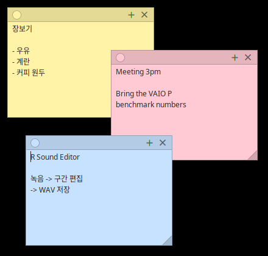

# R Memo for Haiku OS

[English](README.md)

데스크톱에 붙여두는 메모입니다. 메모 하나가 테두리 없는 창이고, 창이 스스로 자기 모습을 그립니다 — 색지, 위쪽 헤더 띠, 오른쪽 아래 접힌 모서리.



## 요구 사항

Haiku (x86 또는 x86_64). 크로스 컴파일러가 필요 없으니 실행할 기기에서 그대로 빌드하시면 됩니다.

## 설치

```sh
./install.sh
```

컴파일한 뒤 바이너리를 `~/config/non-packaged/apps/`에 넣고, **Deskbar → Applications** 메뉴와 **바탕화면** 양쪽에 링크를 만듭니다.

```sh
./install.sh --build-only   # 빌드만 하고 설치하지 않음
./install.sh --uninstall    # 제거
```

## 사용법

- **헤더가 이동 손잡이입니다.** 아무 데나 잡고 끌면 됩니다.
- **접힌 모서리가 크기 조절 손잡이입니다.** 당기면 크기가 바뀝니다.
- **왼쪽 동그라미를 누르면 색상 메뉴**가 나옵니다 (7색).
- **`+` 는 새 메모**를 만듭니다. 현재 메모의 오른쪽 아래로 조금씩 어긋나게 놓입니다.
- **`×` 는 메모를 버립니다.** 내용이 적혀 있으면 먼저 물어봅니다.
- **마지막 메모를 닫으면 앱이 종료**되고, 저장된 메모가 없는 상태로 실행하면 빈 메모 하나가 열립니다.

메모는 종료할 때 `~/config/settings/RMemo/notes` 에 저장되고, 다음 실행에서 내용·위치·크기·색상이 그대로 복원됩니다.

색상 메뉴, 확인 대화상자, 버튼 툴팁은 시스템 언어를 따릅니다: 한국어, 영어, 일본어, 중국어 간체·번체, 러시아어, 터키어, 인도네시아어, 폴란드어, 헝가리어, 독일어, 프랑스어, 이탈리아어, 스페인어, 베트남어.

## 라이선스

MIT

## AI 활용 고지

이 프로그램은 Claude와 함께 작업해 만들었습니다.
